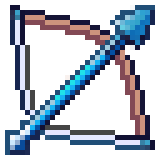

<div id="top"></div>

<!-- PROJECT SHIELDS -->
<!--
*** I'm using markdown "reference style" links for readability.
*** Reference links are enclosed in brackets [ ] instead of parentheses ( ).
*** See the bottom of this document for the declaration of the reference variables
*** for contributors-url, forks-url, etc. This is an optional, concise syntax you may use.
*** https://www.markdownguide.org/basic-syntax/#reference-style-links
-->
[![Contributors][contributors-shield]][contributors-url]
[![Forks][forks-shield]][forks-url]
[![Stargazers][stars-shield]][stars-url]
[![Issues][issues-shield]][issues-url]
[![APACHE-2.0 License][license-shield]][license-url]

<!-- PROJECT LOGO -->
<br />
<div align="center">
  <a href="https://github.com/AtlasEngineCa/AtlasProjectiles">
    
  </a>

  <h3 align="center"></h3>

  <p align="center">
    <br />
    <br />
    <br />
    <a href="https://github.com/AtlasEngineCa/AtlasProjectiles/issues">Report Bug</a>
    ·
    <a href="https://github.com/AtlasEngineCa/AtlasProjectiles/issues">Request Feature</a>
  </p>
</div>

<!-- ABOUT THE PROJECT -->
## About The Project
This is a library to add projectiles.
Currently support projectiles:
- Arrows
- Fireballs
- Items (snowball, enderpearl, etc)

The goal is to make the projectiles act similarly to vanilla, but not all projectiles will be identical.
Contributions are welcome!

<!-- GETTING STARTED -->
## Getting Started

A full, runnable example server can be found [here](https://github.com/AtlasEngineCa/AtlasProjectiles/blob/main/src/test/java/Main.java)

## Credits
- [hapily04](https://github.com/hapily04) Initial bow and arrow projectile code

### Adding as a dependency

Add the following to your `build.gradle.kts` file:

```
repositories {
    maven("https://reposilite.worldseed.online/public")
}
```

Add the library as a dependency
```
dependencies {
    implementation("ca.atlasengine:atlas-projectiles:<version>")
}
```

The lastest version number can be found [here](https://reposilite.worldseed.online/#/public/ca/atlasengine/atlas-projectiles)

<p align="right">(<a href="#top">back to top</a>)</p>

<!-- MARKDOWN LINKS & IMAGES -->
<!-- https://www.markdownguide.org/basic-syntax/#reference-style-links -->
[contributors-shield]: https://img.shields.io/github/contributors/AtlasEngineCa/AtlasProjectiles.svg?style=for-the-badge
[contributors-url]: https://github.com/AtlasEngineCa/AtlasProjectiles/graphs/contributors
[forks-shield]: https://img.shields.io/github/forks/AtlasEngineCa/AtlasProjectiles.svg?style=for-the-badge
[forks-url]: https://github.com/othneildrew/Best-README-Template/network/members
[stars-shield]: https://img.shields.io/github/stars/AtlasEngineCa/AtlasProjectiles.svg?style=for-the-badge
[stars-url]: https://github.com/AtlasEngineCa/AtlasProjectiles/stargazers
[issues-shield]: https://img.shields.io/github/issues/AtlasEngineCa/AtlasProjectiles.svg?style=for-the-badge
[issues-url]: https://github.com/AtlasEngineCa/AtlasProjectiles/issues
[license-shield]: https://img.shields.io/github/license/AtlasEngineCa/AtlasProjectiles?style=for-the-badge
[license-url]: https://github.com/AtlasEngineCa/AtlasProjectiles/blob/master/LICENSE
